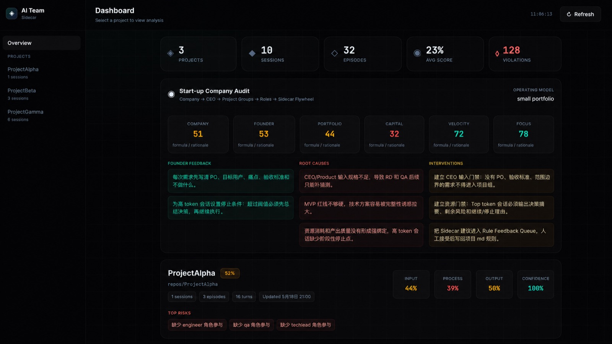
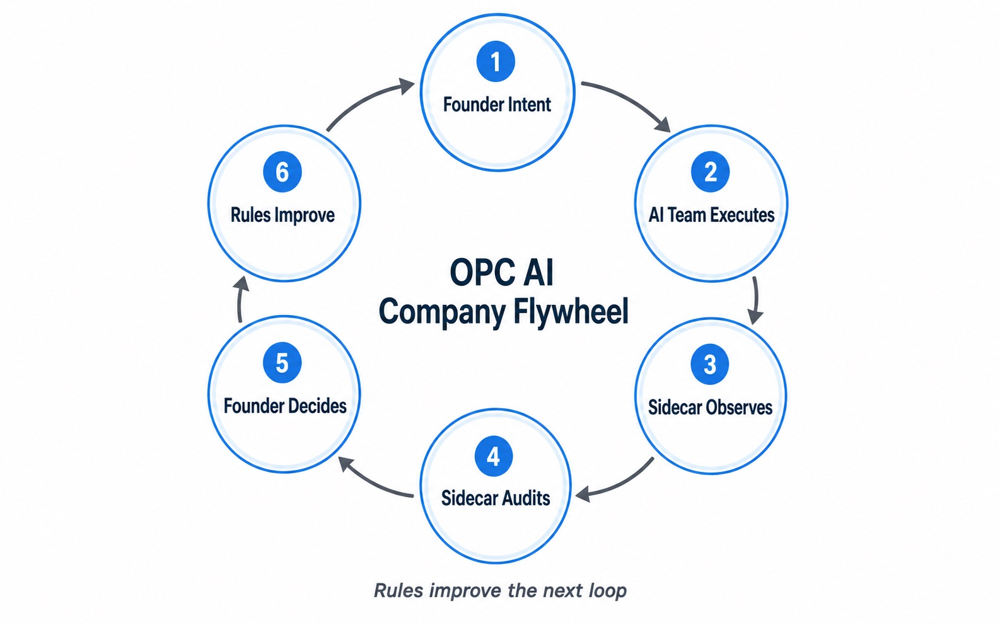

# AiTeam

[](https://github.com/plaxkk/AiTeam/actions/workflows/ci.yml)

Sustainable workflow flywheel for independent developers running an OPC-style AI company.

AiTeam is not just a dashboard. It is built for solo founders and independent developers who operate a personal OPC company with AI agents as the virtual team. It helps you manage local repo projects, improve project rules, audit execution quality, and continuously sharpen the responsibilities of virtual company roles such as Product, RD/Engineer, QA, and Tech Lead.

The product is designed for virtual startups: one human founder stays accountable for direction and judgment, while AI agents execute work and AiTeam turns their conversation trail into a compounding operating system.

AiTeam watches conversations from tools like Claude Code and Codex CLI, groups them by local repository, and evaluates execution quality as a lightweight startup management layer:

```text
Founder / CEO
|
+-- Company Portfolio
|   |
|   +-- Local Repo Project
|       |
|       +-- AI Agent Sessions
|       |   +-- Codex CLI
|       |   +-- Claude Code
|       |
|       +-- Role Quality Lens
|       |   +-- Product
|       |   +-- Engineer
|       |   +-- QA
|       |   +-- Tech Lead
|       |
|       +-- Project PMO Health
|           +-- Input quality
|           +-- Process health
|           +-- Output quality
|           +-- Delivery confidence
|
+-- AiTeam
    |
    +-- Collector -> Local SQLite -> Analysis Engine -> Dashboard
    +-- Audit Findings -> Rule Feedback -> Project .md files -> Next execution loop
```

- Company / founder operating health
- Project PMO health
- Product / RD / QA / Tech Lead role quality
- Prompt and delivery quality with explainability
- Token, tool, and lifecycle cost
- AiTeam audit findings and rule feedback for project `.md` files

Everything runs locally by default. Conversation data is stored in your local SQLite database and is not uploaded.

## Quick Start

```bash
git clone https://github.com/plaxkk/AiTeam.git && cd AiTeam && npm install && npm run start
```

Dashboard opens at `http://localhost:4041`.

<p align="center">
  
</p>

That is enough for Codex CLI data: the dashboard reads local Codex sessions from the default Codex state path when available and groups them by repository `cwd`.

Claude Code collection is optional because it requires adding hooks to Claude Code settings:

```bash
npm run install:claude-hooks
```

The command prints the settings snippet to add. After that, keep `npm run start` running while you use Claude Code.

Optional checks:

```bash
npm run doctor
```

You only need to edit `~/.aiteam/config.json` if you want to restrict monitoring to specific repositories. With the default empty `projects` list, AiTeam accepts every project `cwd` it sees.

## Operating Flywheel

The AiTeam flywheel is shown as a circular operating loop, but the dependency model is a per-iteration DAG plus a cross-iteration feedback loop. Inside one execution loop, the dependencies move forward. The cycle comes from improved rules becoming part of the next loop's operating context.

<p align="center">
  
</p>

This means `Founder Intent` depends on the current project rules, and `Rules Improve` affects the next iteration, not an earlier step in the same iteration. The flywheel works because every AI work session creates management data. Instead of only asking whether the code changed, AiTeam asks whether the company is operating better: Are inputs sharper? Is scope controlled? Are Product, RD/Engineer, QA, and Tech Lead behaviors showing up? Is delivery backed by evidence? Are tokens buying useful progress?

Use it as a weekly or daily operating cadence:

- Start work from a concrete founder brief: goal, user, pain, P0 scope, constraints, and go/no-go criteria.
- Let agents execute inside the repo while AiTeam runs in the background.
- Review the dashboard by project, not by chat transcript: PMO score, risks, role quality, confidence, and cost.
- Accept only rule feedback that would make the next execution loop clearer or stricter.
- Push accepted lessons back into project `.md` files so the AI team becomes easier to manage over time.

The goal is not to automate the CEO away. The goal is to make one founder behave like a tighter company: clearer inputs, smaller loops, better review habits, explicit quality bars, and a compounding rule system that improves every future AI agent run.

## Configuration

Default config path:

```text
~/.aiteam/config.json
```

Example:

```json
{
  "dataDir": "~/.aiteam/data",
  "dashboardPort": 4041,
  "projectsDir": "~/repos",
  "projects": [],
  "agents": {
    "claudeCode": true,
    "codexCli": true
  },
  "privacy": {
    "storeRawPayload": false,
    "storeToolOutput": false
  }
}
```

**Project filtering** (priority from high to low):
1. `projects` — explicit project list with fine-grained control
2. `projectsDir` — parent directory; all subdirectories are treated as projects (auto-detected on first `npm run setup`)
3. Neither set — accept all sessions

During setup, AiTeam auto-detects your projects directory from common conventions (`~/repos`, `~/projects`, `~/code`, `~/dev`, `~/src`, `~/workspace`).

You can also set:

```bash
AITEAM_CONFIG=/path/to/config.json
DATA_DIR=/path/to/data
PORT=4041
```

## Data Storage

Data is local-first. The repository should contain source code only; runtime databases and transcripts stay outside git.

Default data directory:

```text
~/.aiteam/data
```

Main database:

```text
~/.aiteam/data/feedback.db
```

Core tables:

- `sessions`: one Claude/Codex conversation session, grouped by `cwd`.
- `events`: raw agent events.
- `turns`: user prompt, assistant response, duration, token fields.
- `tool_calls`: tool name, input, output, estimated tool tokens.
- `episodes`: task-level slices built from turns.
- `role_evaluations`: Product / Engineer / QA / Tech Lead scores.
- `ceo_reports`, `project_reports`, `company_audit_reports`, `project_audit_reports`: derived reports.
- `rule_feedback_items`: AiTeam recommendations for project rules.

## Claude Code

Claude Code is collected through hooks.

Generate hook scripts:

```bash
npm run install:claude-hooks
```

The command prints a Claude Code settings snippet. Add the generated hook commands to your Claude Code settings.

Runtime flow:

```text
Claude Code hook event
  -> aiteam-hook
  -> ~/.aiteam/data/feedback-pipe
  -> collector daemon
  -> SQLite
  -> analysis engine
  -> dashboard
```

Supported Claude events:

- `SessionStart`
- `UserPromptSubmit`
- `PostToolUse`
- `Stop`

Claude token usage is estimated because Claude Code hooks do not consistently expose billable model token usage. AiTeam estimates:

```text
ceil((visible text chars + tool input/output chars) / 4)
```

Use this as a management signal, not a billing source of truth.

## Codex CLI

Codex CLI is synchronized from local Codex state:

```text
~/.codex/state_5.sqlite
~/.codex/sessions/**/*.jsonl
```

Manual sync:

```bash
npm run sync:codex
```

Sync a single project:

```bash
npm run sync:codex -- ~/projects/my-app
```

Codex token usage uses actual local token counters when available:

- session-level `threads.tokens_used`
- rollout `token_count.total_token_usage`
- turn-level deltas derived from cumulative token counts

## Backfill Claude Transcripts

Import historical Claude transcript files:

```bash
npm run backfill:claude
```

Claude transcripts are read from:

```text
~/.claude/projects
```

If `projects` is configured, only matching project transcript folders are imported.

## Dashboard Views

Overview:

- Company health
- Founder operating score
- Project portfolio
- Capital/token efficiency
- Focus and execution velocity

Project PMO:

- Execution Review — bottleneck, resource, efficiency, goal attainment, action plan
- Project management health
- AiTeam startup audit
- Lifecycle and resource cost
- Agent mix and top token conversations

Diagnostics:

- Team health
- Product / Engineer / QA / Tech Lead scores
- Prompt Quality and Delivery Quality with explainability
- Episode table and conversation drilldown

## Rule Feedback

AiTeam can propose changes to project rules such as:

- `CLAUDE.md`
- `项目规则.md`
- `docs/ITERATION-PROCESS.md`
- `docs/MVP-CHECKLIST.md`

By default it only proposes patches. Applying patches is explicit through the local API:

```text
POST /api/rule-feedback/apply
```

Applied patches are appended to the target file. AiTeam does not silently overwrite user rules.

## Privacy Notes

This tool may store prompts, assistant responses, tool inputs, and tool outputs locally.

Default privacy settings avoid storing duplicate raw hook payloads and tool outputs:

```json
{
  "privacy": {
    "storeRawPayload": false,
    "storeToolOutput": false
  }
}
```

The `turns` table still stores prompt and assistant text because the dashboard needs it for local diagnostics. Do not commit the data directory. Run this before publishing or pushing:

```bash
npm run doctor
git status --short
```

Open-source safety checklist:

- Keep `~/.aiteam/data` or any custom `DATA_DIR` out of the repository.
- Keep `.env`, SQLite files, JSONL transcripts, Claude exports, and Codex exports untracked.
- Prefer configuring `projects` so AiTeam only observes intended repositories.
- Enable `privacy.storeRawPayload` or `privacy.storeToolOutput` only when you explicitly need deeper local diagnostics.

Disabling tool output storage reduces token visibility and diagnostic accuracy.

## Development

```bash
npm run build
npm run doctor
npm run dashboard
npm run daemon
```

Useful API checks:

```text
/api/overview
/api/projects
/api/company-audit
/api/project-management-report?project_path=<path>
/api/project-resource-report?project_path=<path>
/api/execution-review?project_path=<path>
/api/startup-audit?project_path=<path>
/api/rule-feedback?project_path=<path>
```

## License

MIT
